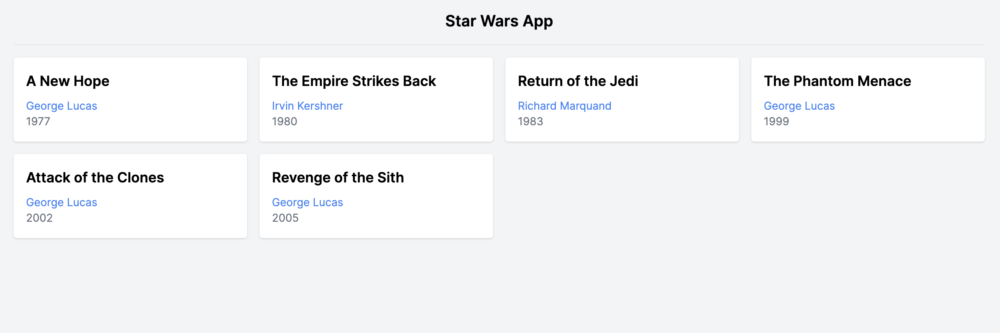
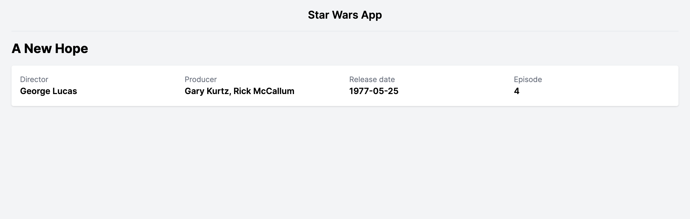
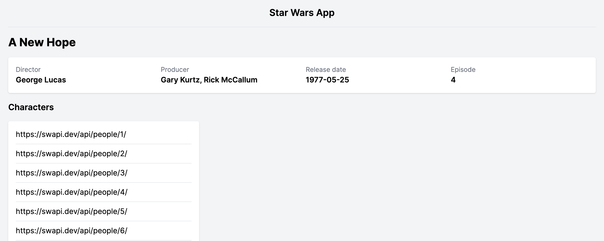
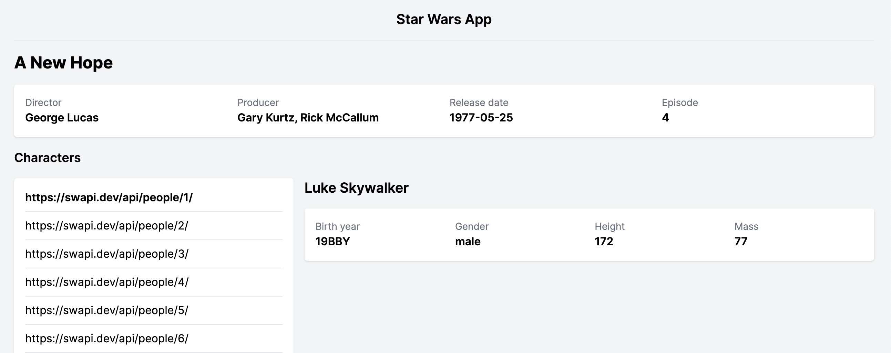
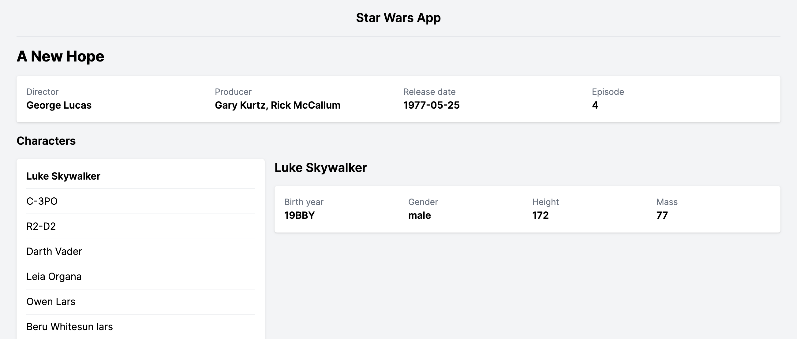

# Vue Router

En aquest repositori faràs servir el _Vue Router_ per construir una SPA amb rutes separades.

Que la força t'acompanyi!

## Objectius

- Fer servir Vue Router per a separar parts lògiques i donar-lis una estructura de rutes.
- Utilitzar els components `<RouterView>` i `<RouterLink>` per a fer servir el router.
- Fer servir el router programàticament
- Generar pàgines amb rutes i sub-rutes
- Utilitzar el _lifecicle hook_ `mounted`.
- Utilitzar `watchers` per a carregar noves dades en una mateixa vista.
- Fer servir _URL params_ i _query params_.
- Fer servir _axios_ com a alternativa a _fetch_.
- Fer servir `Promise.all()` per a treballar amb llistes de promeses.

## Configuració

- Executa `npm install` per instal·lar els paquets (packages).
- Executa `npm run dev` per executar el servidor de desenvolupament.

## Requisits bàsics

### 0. Estudia l'estructura de fitxers

- Fixa't en `routes.js`, on hi definim les rutes de l'aplicació, i com cadascuna d'aquestes té un component associat. Mira com es carreguen a l'arxiu `main.js`.
- Els components principals (components "de pàgina") van dins de la carpeta `views`.
- Fixa't en com el component `<App />` delega quin component que es mostrarà a través del component `<RouterView />`.

### 1. Crea una homepage

- Ha de mostrar una llista de pel·lícules en carregar la pàgina `<Home />`.
  - Carregarem les dades de [The Star Wars API](https://swapi.dev/). Passa 10 minuts llegint-ne la documentació per entendre com funcionen els diferents _endpoints_.
  - Hauràs de llegir sobre [lifecycle hooks](https://vuejs.org/guide/essentials/lifecycle.html) per a fer servir el _lifecicle hook_ `mounted` i carregar les dades quan la pàgina es carregui.
  - Utilitza `fetch` o [axios](https://github.com/axios/axios) per a carregar les dades en el mètode `getFilms`. Hauràs de cridar `getFilms` en el mètode `mounted`. Les dades les carregarem de l'_endpoint_ `/films/`.
  - Afegeix un _state_ de _loading_ per quan les dades s'estàn carregant.
  - Afegeix estils a la pàgina i dóna-li el disseny que més t'agradi. Pots triar quines dades mostres per a cada pel·lícula.

### 2. Crea la pàgina de pel·lícula i enllaça-la a la llista

- Cada pel·lícula ha de tenir un enllaç a la seva pàgina.
  - Crea un nou component `Film`, dins de `views`, per a mostrar la informació de la pel·lícula.
  - Crea una nova ruta a l'arxiu `routes.js`. Has de triar un nom per la ruta i associar-hi el component que acabes de crear.
  - Necessitaràs un _param_ en aquesta ruta per a identificar la pel·lícula que es mostrarà.
  - Enllaça la ruta a la llista de pel·lícules de la _home_ mitjançant `<RouterLink>`.
  - El mètode `getId()` et permet obtenir el ID d'una URL. El pots utilitzar per a generar els teus links correctament.

### 3. Carrega la informació de la pel·lícula

- Has de mostrar la informació de la pel·lícula en la pàgina de la pel·lícula.
  - En el component `Film`, carrega les dades de la pel·lícula de la API, com has fet en el component `Home`. Crea els mètodes, `data` i _lifecycle hooks_ que necessitis.
  - Mostra les dades a la pàgina.
  - Afegeix un _state_ de _loading_ per quan les dades s'estàn carregant.
  - Afegeix estils a la pàgina i dóna-li el disseny que més t'agradi.

### 4. Mostra la llista de personatges a la pàgina de la pel·lícula

Com que, de moment, no tenim els noms de les pel·lícules, pots posar-hi només l'enllaç, com si en fos el nom.

### 5. Crea la sub-pàgina de personatge

- Crea una nova [nested route](https://router.vuejs.org/guide/essentials/nested-routes.html) a l'arxiu `routes.js` com a sub-ruta de "film" per a mostrar un personatge.
  - Defineix el/s paràmetres que necessitis en aquesta nova ruta per tal de representar l'ID del personatge.
  - Crea un nou component `<Character />` que mostri la informació del personatge, extreta de la API.
  - Enllaça cadascun dels noms de personatge amb la nova sub-ruta, mitjançant `<RouterLink />`.
  - Per tal que es mostri la sub-ruta dins la ruta principal, hauràs d'utilitzar el component `<RouterView />` dins del component `<Film />`.
  - Arribat a aquest punt, si selecciones un personatge, i després en selecciones un altre, la informació no s'actualitzarà. Hauràs de llegir sobre [watchers](https://vuejs.org/guide/essentials/watchers.html) per a regarregar les dades necessàries quan volguem mostrar un personatge diferent.

### 6. Substitueix la llista de URLs pels noms dels personatges

- Pots carregar les dades de cada personatge de la API, simultàneament, amb [Promise.all()](https://developer.mozilla.org/en-US/docs/Web/JavaScript/Reference/Global_Objects/Promise/all). Llegeix l'article per entendre com llançar varies `Promise` de cop i esperar que totes es resolguin.
- Crea un nou _state_ `characters` en el component `<Film />`.
- La funció on carregues les dades principals de la pel·lícula, haurà de carregar, **després**, les dades de cada personatge, i guardar-les al nou _state_ que has creat.
- Pista: pots utilitzar una combinació de `Promise.all()`, `map` i `axios` per a carregar aquesta informació.
- Substitueix les URLs pels noms de cada personatge en el teu `template`.

### 7. OPCIONAL. Millora tot allò que puguis de la app.

- Dónali un estil visual millorat.
- Afegeix més seccions a la pàgina de la pel·lícula.
- Afegeix altres pàgines (planetes, vehicles...) i enllaceles a la pàgina de la pel·lícula o entre elles.
- Afegeix una pàgina de personatges.
- Afegeix un cercador de personatges.
- Optimitza el teu codi reutilitzant components i fes-lo més compacte.

## Recursos

- [Vue Router](https://router.vuejs.org/introduction.html)
- [Vue Documentation](https://vuejs.org/guide/introduction.html)
- [Vue lifecycle hooks](https://vuejs.org/guide/essentials/lifecycle.html)
- [Vue watchers](https://vuejs.org/guide/essentials/watchers.html)
- [Axios](https://github.com/axios/axios)
- [The Star Wars API](https://swapi.dev/)
- [Promise.all()](https://developer.mozilla.org/en-US/docs/Web/JavaScript/Reference/Global_Objects/Promise/all)

## Notes

_Aquest és un projecte d'estudiant creat a [CodeOp](http://CodeOp.tech), al bootcamp de Front End Development a Barcelona._
# star-wars
